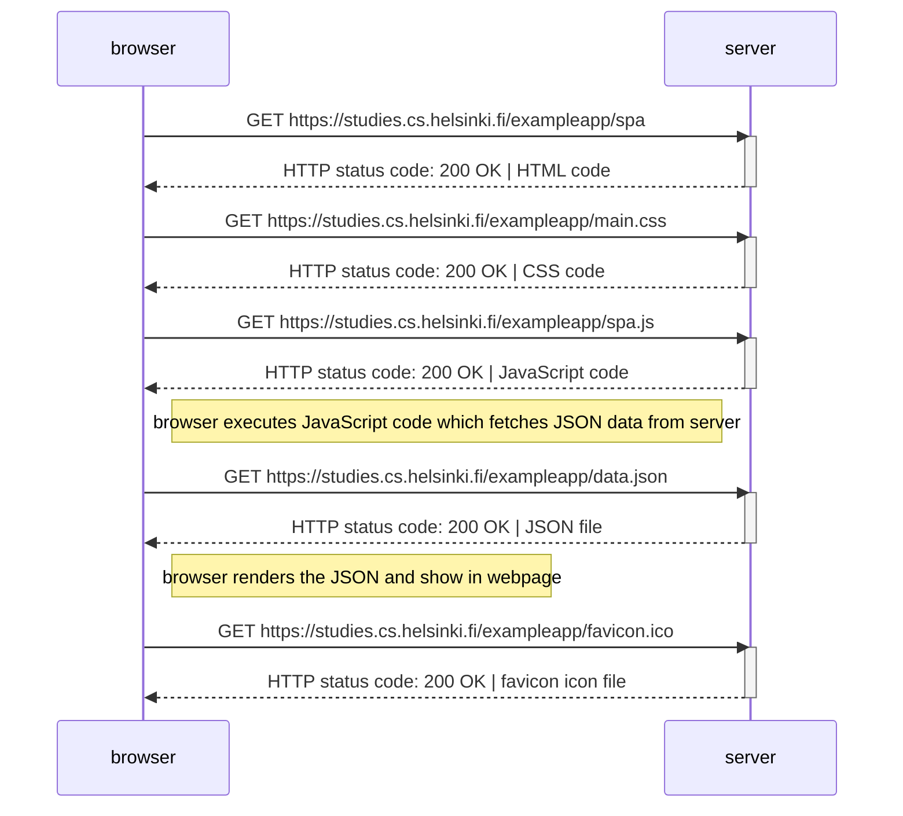

```mermaid

sequenceDiagram

    participant browser
    participant server

    browser->>server: GET https://studies.cs.helsinki.fi/exampleapp/spa
    activate server
    server-->>browser: HTTP status code: 200 OK | HTML code
    deactivate server

    browser->>server: GET https://studies.cs.helsinki.fi/exampleapp/main.css
    activate server
    server-->>browser: HTTP status code: 200 OK | CSS code
    deactivate server

    browser->>server: GET https://studies.cs.helsinki.fi/exampleapp/spa.js
    activate server
    server-->>browser: HTTP status code: 200 OK | JavaScript code
    deactivate server

    Note right of browser: browser executes JavaScript code which fetches JSON data from server

    browser->>server: GET https://studies.cs.helsinki.fi/exampleapp/data.json
    activate server
    server-->>browser: HTTP status code: 200 OK | JSON file
    deactivate server

    Note right of browser: browser renders the JSON and show in webpage

    browser->>server: GET https://studies.cs.helsinki.fi/exampleapp/favicon.ico
    activate server
    server-->>browser: HTTP status code: 200 OK | favicon icon file
    deactivate server

```
