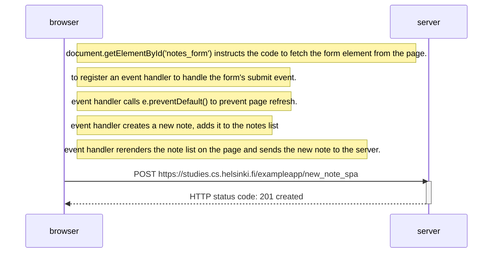

```mermaid

sequenceDiagram

    participant browser
    participant server

    Note right of browser: document.getElementById('notes_form') instructs the code to fetch the form element from the page.

    Note right of browser: to register an event handler to handle the form's submit event.

    Note right of browser: event handler calls e.preventDefault() to prevent page refresh.

    Note right of browser: event handler creates a new note, adds it to the notes list

    Note right of browser: event handler rerenders the note list on the page and sends the new note to the server.

    browser->>server: POST https://studies.cs.helsinki.fi/exampleapp/new_note_spa
    activate server
    server-->>browser: HTTP status code: 201 created
    deactivate server


```
